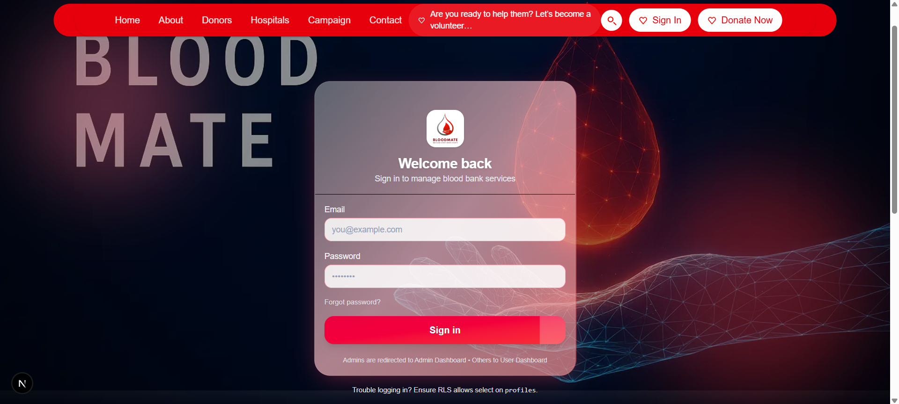
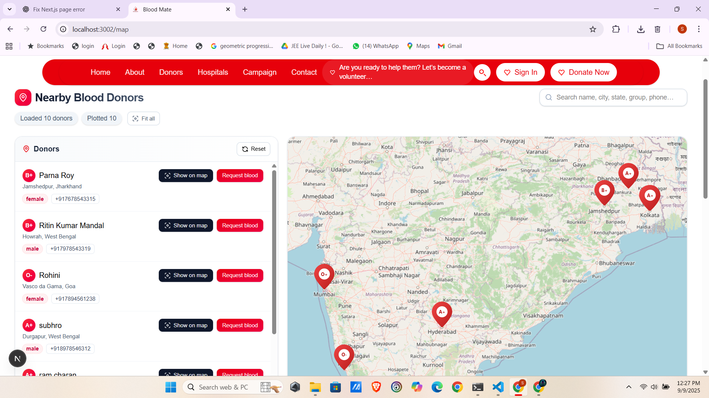
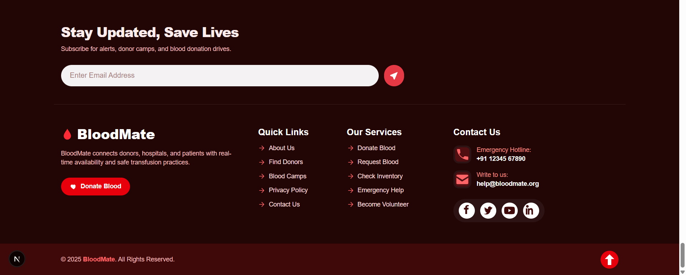
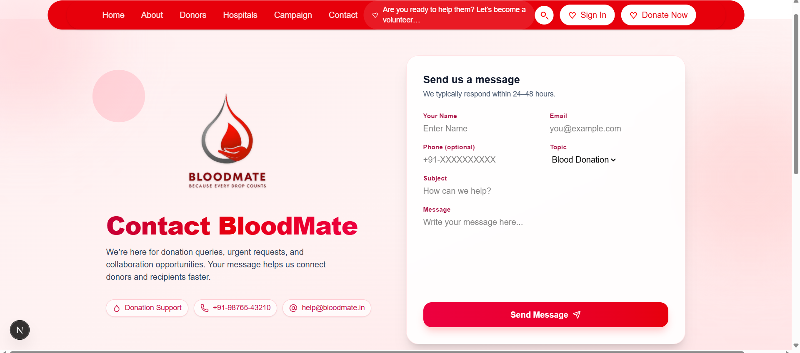

# 🩸 BloodMate — Smart Blood Bank Management System

Production-ready **Next.js** application for a modern blood donation and management ecosystem. Built with a refined **UI (deep blue, cyan, yellow, white gradients)**, smooth motion, and a powerful backend powered by **Supabase**.

  

---

## Vercel Link
https://blood-mate-website-next-js.vercel.app/

## 📸 Screenshots and Demos
  
  
  
  
  

---

## ✨ Features

- Elegant, responsive UI with **Tailwind CSS** + **Framer Motion**
- Dynamic **Donor & Hospital Dashboards**
- Interactive **Leaflet Maps** to locate donors and hospitals
- **Blood Stock Management** with real-time updates
- **Blood Requests** system: hospitals ↔ donors
- **Appointment Booking** for blood donation slots
- Built-in **Blood Compatibility Guide**
- **Auth** (Sign in / Sign up) with profile + donor details
- **Supabase** backend: Auth, Database, Storage
- Smooth animations, alerts, and toasts for delightful feedback

---

## 🧰 Tech Stack

- **Next.js 14**
- **Tailwind CSS**
- **Framer Motion**
- **Leaflet.js** (maps & geolocation)
- **Supabase** (Auth, Database, Storage)
- **react-hot-toast**, **SweetAlert2**

> Build tooling: works with **Next.js** dev server (`npm run dev`) and supports **Vercel deployment**

