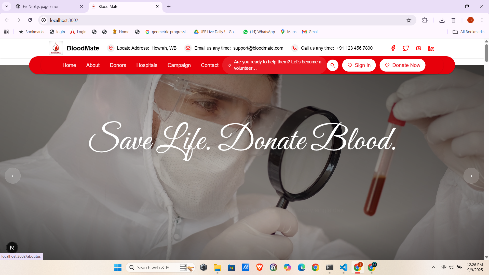

# BloodMate

<p align="center">
  
</p>

> **Community-driven blood bank & donor coordination.**  
> Verify requests, match donors fast, and keep patient data private.

[](#)
[](#)
[](#)
[](#)
[](#license)

---

## 📸 Screenshots & Demo

> Put these images in `public/images/readme/` (filenames below). You can swap PNG/JPG/WebP freely.

| View | File | Notes |
|---|---|---|
| Landing / Hero | `hero.png` | 1600×900, your brand colors |
| Hospital Map | `map.png` | Leaflet map with markers |
| Create/Verify Request | `request_flow.png` | step-by-step or a single composite |
| Donor Profile | `donor_profile.png` | profile + availability |
| Admin Dashboard | `admin_dashboard.png` | approvals + quick stats |

**Optional GIF (demo):** `demo.gif` (put it in the same folder)

```html
<p align="center">
  <br/>
  
</p>
